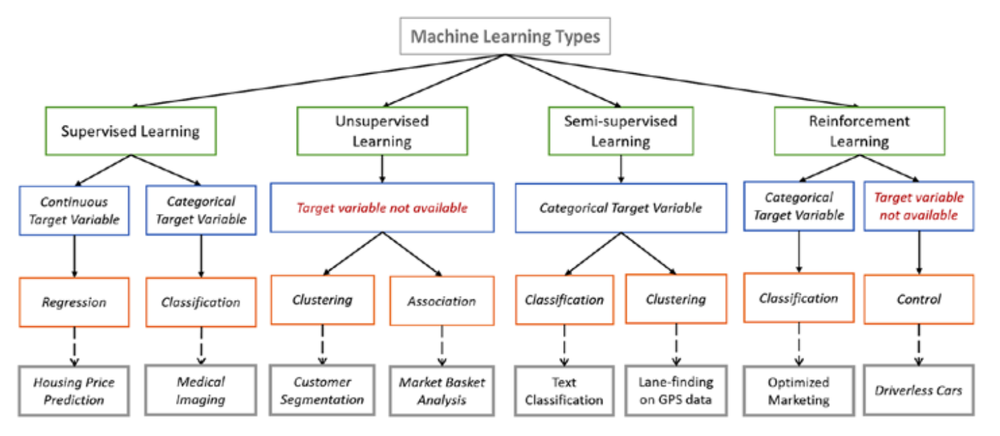
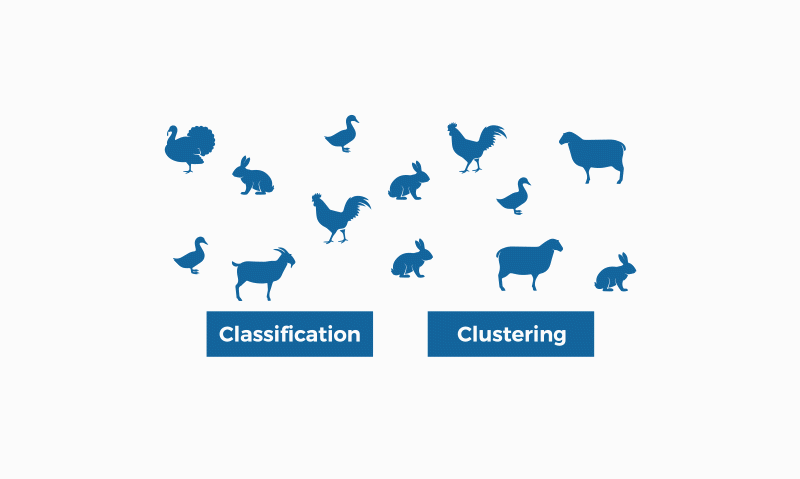
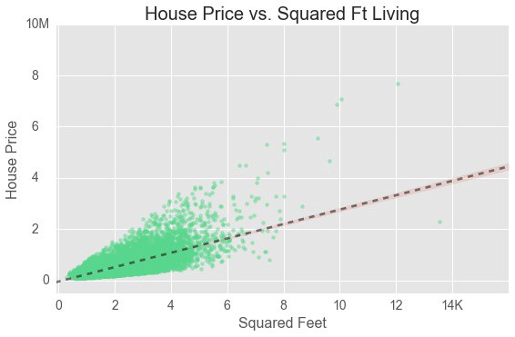

# Machine Learning

Machine learning is an application of artificial intelligence (AI) that provides systems the ability to automatically learn the pattern from the data and improve from experience without being explicitly programmed. 

💫 **Types of learning algorithms:**

- Supervised learning (classification and regression)
- Unsupervised learning (Clustering)
- Semi-supervised learning
- Reinforcement learning ( game theory, control theory, operations research, information theory, simulation-based optimization, multi-agent systems, swarm intelligence, statistics and genetic algorithms)

[1]https://en.proft.me/2015/12/24/types-machine-learning-algorithms/

💫 **Different Machine learning problem:**

> **Clustering**: It is the problem of identifying to which of a set of category unseen data belongs, on the basis of a training data whose category is known. 
>
> Applications:

- Email spam classification
- Bank customers loan pay bank willingness prediction.
- Cancer tumour cells identification.
- Sentiment analysis.
- Drugs classification
- Facial key points detection
- Pedestrians detection in an automotive car driving.

> **Classification**: It is the problem of grouping a set of objects in such a way that objects belong in the same group are similar to each other.
>
> Applications:

- Recommender systems
- Anomaly detection
- Human genetic clustering
- Genom Sequence analysis
- Analysis of antimicrobial activity
- Grouping of shopping items
- Search result grouping
- Slippy map optimization
- Crime analysis
- Climatology

> **Regression**: It is a process of finding the correlations between dependent and independent variables, and helps in predicting the continuous variables such as prediction of Market Trends, prediction of House prices, etc.

[2]https://medium.com/@datalesdatales/predicting-house-prices-with-linear-regression-595422992c48

> Dimensional Reduction: Techniques are also used to reduce two undesired characteristics in data namely noise (variance) and redundancy (highly correlated variables). 

[3]http://www.turingfinance.com/artificial-intelligence-and-statistics-principal-component-analysis-and-self-organizing-maps/

